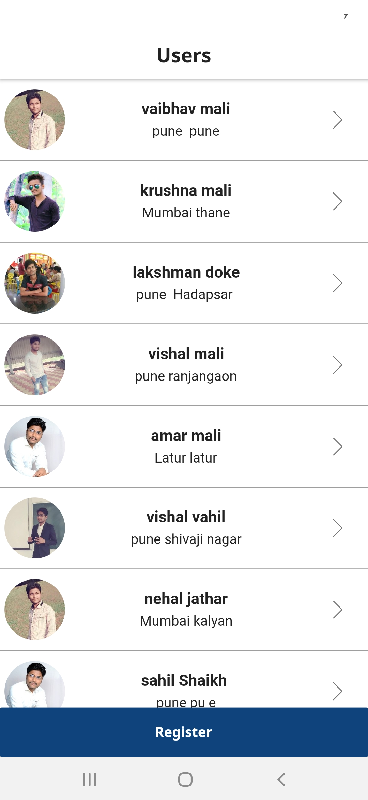
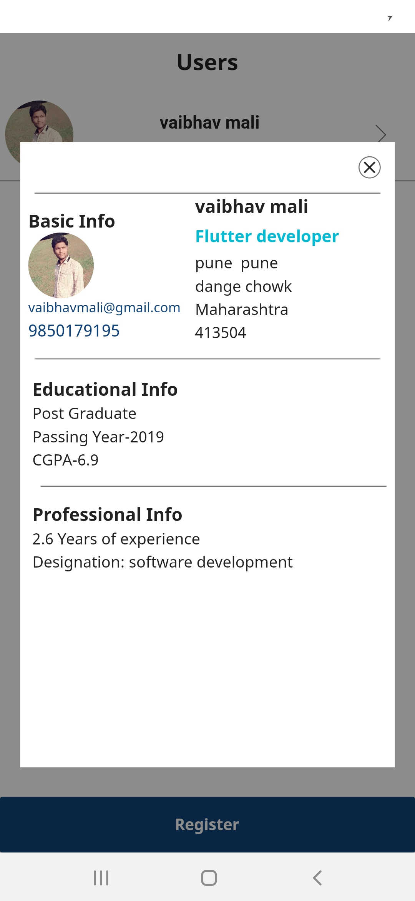
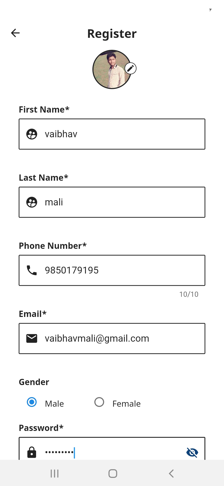
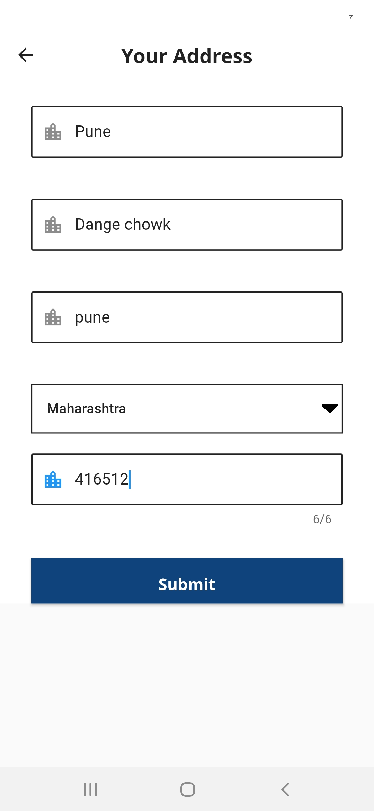

# registrationform_assignment

## Getting Started

This project is about to registration form demo.

Software & IDE Requirements
        <h2>ScreenShots<h2>
                
                
                
                
                
                              
        * This project is developed and below software & Ide configuration
        
        * Flutter SDK version 1.22.4 stable
        
        * please desable the sound nullsafety
        
        * please set your environment to
            
            sdk: ">=2.7.0 <3.0.0"   support
             
             Database: SQLite 1.2.0 is used for local storage
        
        
        HomePage  ](https://user-images.githubusercontent.com/58940316/117782498-8a94a280-b1f6-11eb-83b8-688102309aca.jpg)
